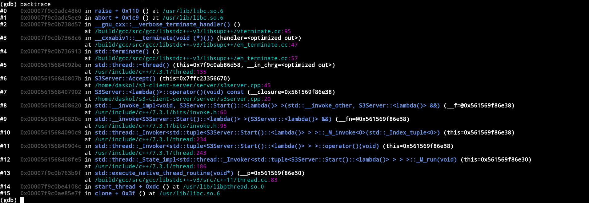

# GDB Colour Filter

*colourify backtrace output in GDB with Python API*

## Overview

**GDB Colour Filter** implements frame filter for GDB Python API. There could
be several chained filters. GDB calls this filter on each element(frame) of
backtrace. All frame filter has a priority from the lowest (0) to the high.
This filter is defined for the lowest priority so it is the last filter that is
called before printing stack trace.



## Installation

Installation is quite straight forward. It is needed only put `color_filter.py`
in some directory and include it into your `.gdbinit` file. In order to do the first step one could clone whole repository

```bash
    git clone https://github.com/daskol/gdb-colour-filter.git .gdb/gdb-colour-filter
```

or just download `could_filter.py` in the specified directory.

```bash
    mkdir -p .gdb/gdb-colour-filter
    wget -O .gdb/gdb-colour-filter/colour_filter.py \
        https://raw.githubusercontent.com/daskol/gdb-colour-filter/master/colour_filter.py
```

After that `colour_filter.py` should be included in `.gdbinit` in following
manner.

```bash
    source ~/.gdb/gdb-colour-filter/colour_filter.py
```

## Credits

&copy; Daniel Bershatsky \<[daniel.bershatsky@skolkovotech.ru](mailto:daniel.bershatsky@skolkovotech.ru)\>, 2018
